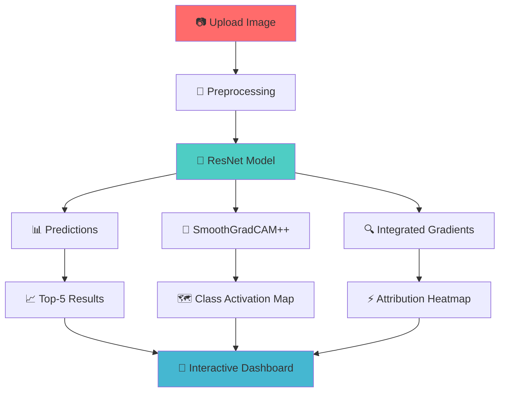

# 🔬 Deep-Viz: Unveiling the Black Box of Deep Learning

<div align="center">


*"Seeing is believing, but understanding is enlightening"* 🧠✨

</div>

## 🌟 What is Deep-Viz?

Deep-Viz is an interactive web application that makes AI interpretability accessible to everyone! Ever wondered what a neural network "sees" when it looks at an image? This tool pulls back the curtain on deep learning models, revealing the hidden patterns and decision-making processes that drive AI predictions.

## 🎯 Features

### 🔍 **Model Interpretability Made Simple**
- **Class Activation Maps (CAM)** using SmoothGradCAM++ 🎨
- **Integrated Gradients** for pixel-level feature attribution 📊
- **Real-time visualization** of model predictions 🚀
- **Multi-model support** (ResNet18 & ResNet50) ⚙️

### 🎨 **Interactive Experience**
- **Drag-and-drop** image upload 📤
- **Layer-wise exploration** of neural network activations 🔬
- **Top-5 predictions** with confidence scores 📈
- **Side-by-side comparison** of different visualization techniques 🔄

## 🧠 How It Works



## 🚀 Quick Start

### Prerequisites
Make sure you have Python 3.7+ installed on your system.

### Installation

1. **Clone the repository**
```bash
git clone https://github.com/nevrohelios/deep-viz.git
cd deep-viz
```

2. **Install dependencies**
```bash
pip install -r requirements.txt
```

3. **Launch the application**
```bash
streamlit run main.py
```

4. **Open your browser** and navigate to `http://localhost:8501` 🌐

## 📚 Understanding the Visualizations

### 🎨 Class Activation Maps (CAM)
CAMs highlight the regions in an image that are most important for the model's prediction. Think of it as the model's "attention map" - where is it looking when making decisions?

```
🖼️ Original Image → 🔥 Heat Map → 🎯 Important Regions
```

### ⚡ Integrated Gradients
This technique provides pixel-level attributions, showing how much each pixel contributes to the final prediction. It's like having X-ray vision into the model's decision process!

```
🔍 Pixel Analysis → 📊 Attribution Scores → 🎨 Visualization
```

## 🔧 Technical Architecture

### 📦 Core Components

| Component | Purpose | Technology |
|-----------|---------|------------|
| 🎨 **Frontend** | Interactive UI | Streamlit |
| 🤖 **Model Backend** | Deep Learning | PyTorch + TorchVision |
| 🔍 **Interpretability** | CAM Generation | TorchCAM |
| ⚡ **Attribution** | Gradient Analysis | Captum |
| 🖼️ **Image Processing** | Preprocessing | PIL + Transforms |

### 🏗️ Model Architecture

```
Input Image (224×224×3)
     ↓
ResNet18/50 Backbone
     ↓
Feature Extraction
     ↓
┌─────────────────┬─────────────────┐
│  CAM Extraction │ Gradient Flow   │
│  (TorchCAM)     │ (Captum)        │
└─────────────────┴─────────────────┘
     ↓
Visualization Pipeline
     ↓
Interactive Dashboard
```

## 🎮 Usage Examples

### 🐕 Example 1: Animal Classification
Upload a photo of your pet and see which features the model uses to identify the animal!

### 🏞️ Example 2: Scene Understanding
Try landscape photos to understand how the model recognizes different environments.

### 🚗 Example 3: Object Detection
Upload images with vehicles to see how the model focuses on distinctive features.

## 🔬 Advanced Features

### 🎛️ **Layer Selection**
Explore different layers of the neural network to understand how features evolve from simple edges to complex patterns:

- **Early Layers**: Edge detection, basic shapes 📐
- **Middle Layers**: Textures, patterns 🌀
- **Deep Layers**: Complex objects, semantic features 🏗️

### 📊 **Model Comparison**
Switch between ResNet18 and ResNet50 to see how model depth affects interpretation:

| Model | Parameters | Speed | Accuracy |
|-------|------------|-------|----------|
| ResNet18 | 11.7M | ⚡ Fast | 🎯 Good |
| ResNet50 | 25.6M | 🐌 Slower | 🎯 Better |

## 🔮 What Makes This Special?

### 🎨 **Visual Excellence**
- Clean, intuitive interface designed for both beginners and experts
- Real-time processing with smooth animations
- High-quality visualizations that reveal model insights

### 🧪 **Educational Value**
- Perfect for students learning about AI interpretability
- Demonstrates cutting-edge explainable AI techniques
- Bridges the gap between theory and practice

### 🚀 **Production Ready**
- Robust error handling and user feedback
- Optimized for performance
- Extensible architecture for adding new models

## 🛠️ Dependencies

```python
# Core ML Framework
torch              # PyTorch deep learning framework
torchvision        # Computer vision utilities
torchcam           # Class Activation Mapping

# Interpretability
captum             # Model interpretability library

# Web Framework
streamlit          # Interactive web applications

# Image Processing
pillow             # Python Imaging Library
numpy              # Numerical computing
matplotlib         # Plotting library
```

## 🔄 Future Enhancements

- [ ] 🎯 **More Models**: Add support for Vision Transformers, EfficientNet
- [ ] 🎨 **Advanced Visualizations**: GradCAM, LIME, SHAP
- [ ] 📱 **Mobile Support**: Responsive design for mobile devices
- [ ] 🔗 **API Integration**: REST API for programmatic access
- [ ] 🎥 **Video Analysis**: Extend to video classification
- [ ] 🌐 **Multi-language**: Support for multiple languages

## 🤝 Contributing

We welcome contributions! Whether it's:
- 🐛 Bug fixes
- ✨ New features
- 📚 Documentation improvements
- 🎨 UI/UX enhancements

Please feel free to open issues and pull requests!

## 📄 License

This project is licensed under the MIT License - see the [LICENSE](LICENSE) file for details.

## 🙏 Acknowledgments

- **PyTorch Team** for the amazing deep learning framework 🔥
- **Streamlit** for making web apps incredibly simple 🚀
- **Captum** for state-of-the-art interpretability tools 🔍
- **TorchCAM** for excellent CAM implementations 🎨

---

<div align="center">

**Made with ❤️ and lots of ☕**

*Star ⭐ this repo if you found it helpful!*

</div>
